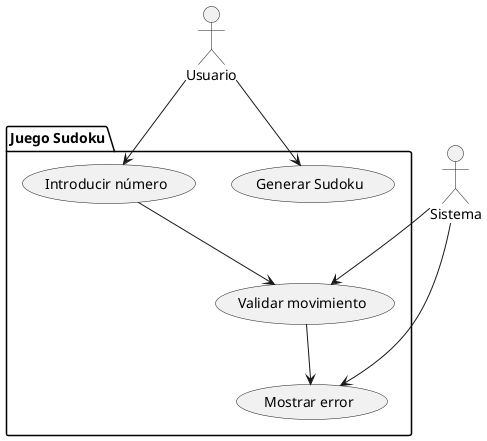
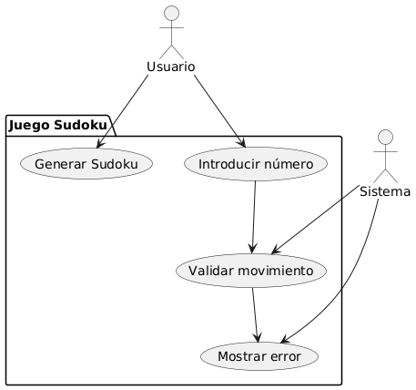
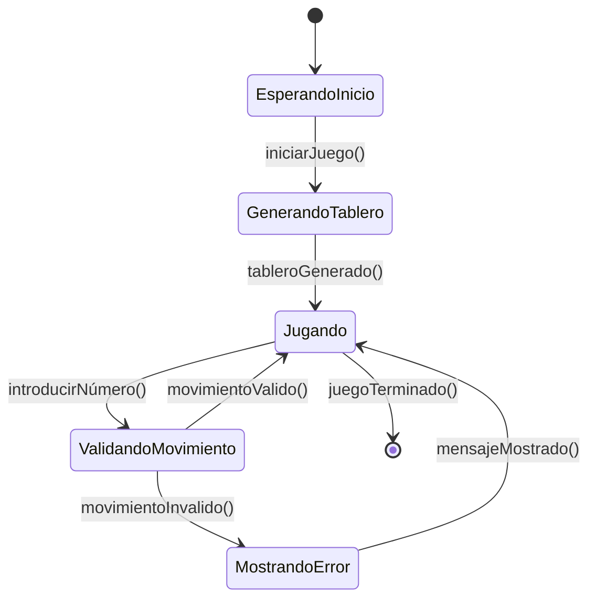
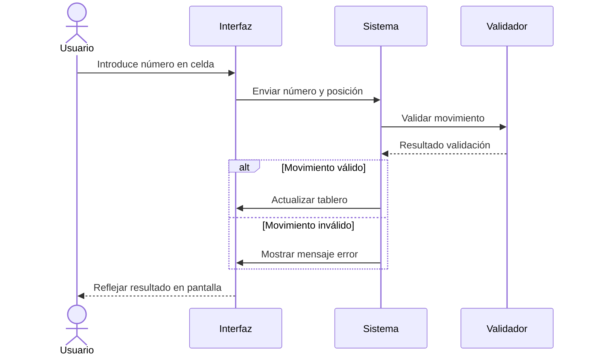
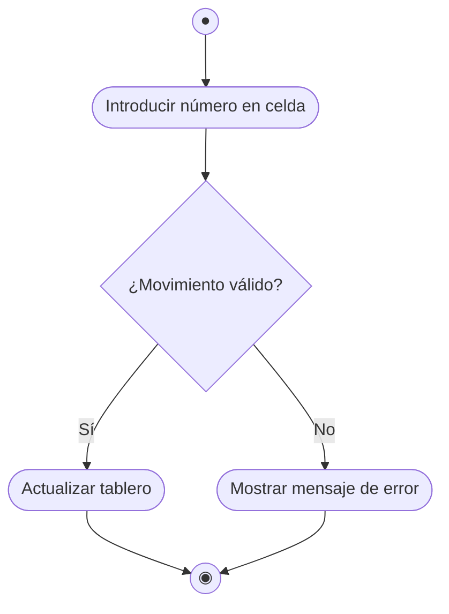
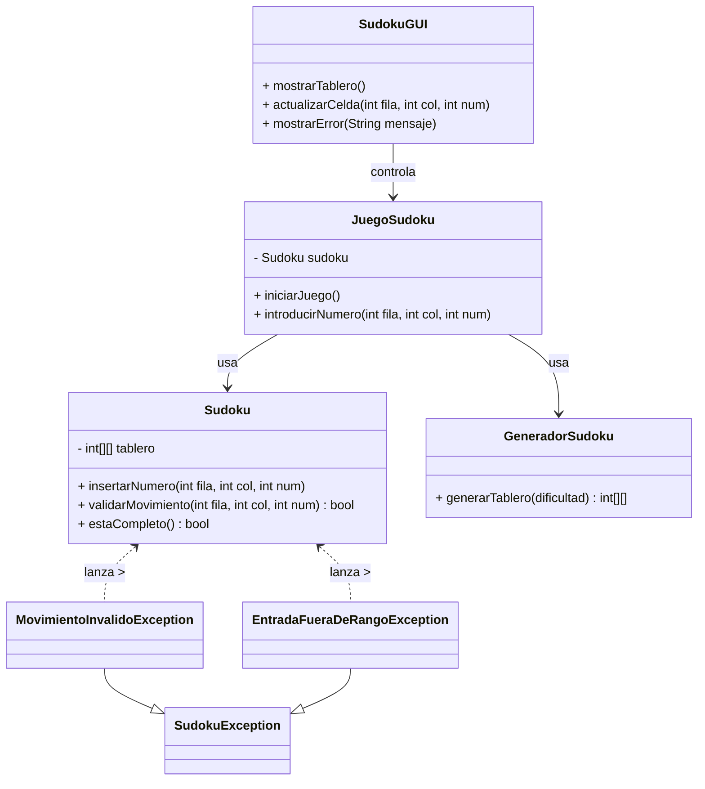

# Proyecto Sudoku

## Descripción general
Este proyecto consiste en una aplicación para jugar Sudoku, con funcionalidades para generar tableros, validar movimientos, manejar excepciones específicas, e interacción mediante interfaz gráfica. El objetivo es desarrollar un sistema robusto que permita jugar Sudoku de forma interactiva y con reglas estrictas.

## Requisitos Funcionales

| ID    | Descripción                                                  | Prioridad | Fuente  | Estado       |
| ----- | ------------------------------------------------------------ | --------- | ------- | ------------ |
| RF-01 | Generar tableros válidos de Sudoku con niveles variados      | Alta      | Cliente | Implementado |
| RF-02 | Permitir al usuario introducir números en el tablero         | Alta      | Cliente | Implementado |
| RF-03 | Validar que los movimientos cumplan las reglas de Sudoku     | Alta      | Cliente | Implementado |
| RF-04 | Mostrar mensajes de error para movimientos inválidos         | Media     | Cliente | Implementado |
| RF-05 | Manejar excepciones personalizadas (ej. Movimiento inválido) | Alta      | Cliente | Implementado |
| RF-06 | Proveer interfaz gráfica para jugar Sudoku                   | Alta      | Cliente | Implementado |

## Requisitos No Funcionales

| ID     | Descripción                                     | Categoría      | Métrica             | Nivel Objetivo   | Comentarios                   |
| ------ | ----------------------------------------------- | -------------- | ------------------- | ---------------- | ----------------------------- |
| RNF-01 | La respuesta ante una acción debe ser inmediata | Rendimiento    | Tiempo de respuesta | < 1 segundo      | Experiencia fluida            |
| RNF-02 | La interfaz debe ser intuitiva y accesible      | Usabilidad     | Puntuación UX       | ≥ 4 / 5          | Facilitar uso a principiantes |
| RNF-03 | Código modular y documentado                    | Mantenibilidad | Calidad Código      | 100% Documentado | Facilita mantenimiento        |

## Casos de Uso

| ID    | Nombre             | Actor(es) | Precondición                  | Flujo Principal                                           | Flujos Alternativos                 | Postcondición                   |
| ----- | ------------------ | --------- | ----------------------------- | --------------------------------------------------------- | ----------------------------------- | ------------------------------- |
| CU-01 | Generar Sudoku     | Usuario   | Inicio de juego               | 1. Usuario selecciona nivel 2. Sistema genera tablero  | 2a. Error generación → mensaje      | Tablero Sudoku generado         |
| CU-02 | Introducir número  | Usuario   | Tablero generado              | 1. Usuario introduce número en celda 2. Sistema valida | 2a. Número inválido → error         | Número insertado o rechazo      |
| CU-03 | Validar movimiento | Sistema   | Número introducido            | 1. Sistema comprueba reglas Sudoku                        | 1a. Movimiento inválido → excepción | Movimiento aceptado o rechazado |
| CU-04 | Mostrar error      | Sistema   | Movimiento inválido detectado | 1. Sistema muestra mensaje de error                       | -                                   | Usuario informado del error     |

## Diagrama de Casos de Uso

## Objetivos

| ID     | Objetivo                                       | Tipo        | Métrica                      | Fecha Límite | Responsable |
| ------ | ---------------------------------------------- | ----------- | ---------------------------- | ------------ | ----------- |
| OBJ-01 | Proveer un juego funcional y estable de Sudoku | Estratégico | 100% funciones implementadas | 2025-06-30   | Equipo dev  |
| OBJ-02 | Garantizar respuesta rápida en la UI           | Operativo   | Tiempo respuesta < 1 s       | 2025-06-30   | Equipo dev  |
| OBJ-03 | Documentar código y funcionalidades            | Táctico     | 100% código documentado      | 2025-06-15   | Equipo dev  |

## Matriz de Trazabilidad

| Req. ID | Objetivo(s) | Caso de Uso / Diseño     | Caso de Prueba               |
| ------- | ----------- | ------------------------ | ---------------------------- |
| RF-01   | OBJ-01      | CU-01 Generar Sudoku     | TP-01 Generación tablero     |
| RF-02   | OBJ-01      | CU-02 Introducir número  | TP-02 Inserción número       |
| RF-03   | OBJ-01      | CU-03 Validar movimiento | TP-03 Validación movimientos |
| RF-04   | OBJ-01      | CU-04 Mostrar error      | TP-04 Mensajes de error      |

## Diagrama de Estado del juego

## Diagrama de Secuencia al introducir un número

## Diagrama de Actividad

## Excepciones 

El proyecto implementa excepciones específicas para manejar errores particulares:

- SudokuException.java: Clase base para las excepciones personalizadas en el proyecto.

- MovimientoInvalidoException.java: Excepción lanzada cuando un movimiento viola las reglas del Sudoku.

- EntradaFueraDeRangoException.java: Excepción para entradas fuera de los límites válidos del tablero.

## Diagrama UML

